# 🛡️ VANGUARD: Versatile Aggregation for Networked Governance Using Unified AI with Reinforced Decisionin


**VANGUARD** is an advanced, modular network intrusion detection and governance system that integrates cutting-edge techniques in artificial intelligence (AI), federated learning, differential privacy (DP), and blockchain-inspired aggregation mechanisms to ensure real-time, scalable, and secure detection of network anomalies and cyber threats.

The system is designed to optimize the detection of malicious activities in highly distributed network environments, such as enterprise infrastructures or Internet of Things (IoT) networks. It leverages a combination of federated learning, reinforcement learning (RL), multi-party aggregation, and differential privacy to create a robust and adaptive defense system that evolves and adapts as new threats emerge, all while preserving the privacy of the data it processes.

---

## 🎯 Key Features and Components

### 🧠 Global and Local Model Architecture
- **🌐 Global Model**: A Random Forest model is initially trained on a large, public dataset (such as the CIC-IDS-2017 collection). This global model acts as a foundational intrusion detection engine.
- **🎯 Local Fine-Tuning**: The model is distributed to local nodes (such as remote devices or edge servers) where it undergoes fine-tuning. The fine-tuning process incorporates reinforcement learning (RL) for dynamic decision-making and uses Nash Bargaining to optimally allocate resources for differential privacy budget.

### 🔒 Differential Privacy (DP) and Privacy-Preserving Learning
To ensure the privacy of data used in training, the system introduces Gaussian noise into the fine-tuning process. This ensures the differential privacy of the individual data contributors and prevents leakage of sensitive information.

### 🤝 Federated Learning Framework
- **📡 Federated Learning** is employed to train machine learning models across distributed nodes without requiring the data to leave individual systems. This helps maintain data privacy and minimizes the need for expensive central storage or computation.
- The fine-tuned local models are aggregated back into the global model using a blockchain-inspired, reputation-based aggregation mechanism called **Multi-Krum**, which ensures robust aggregation even in the presence of Byzantine failures (faulty or malicious nodes).

### 🚨 Anomaly Detection with Random Forest Classifier
The system's core detection engine is based on a **Random Forest** algorithm, which is trained and continuously updated on network traffic patterns. This allows the system to detect anomalies (such as DDoS attacks, port scanning, or unauthorized access) effectively.

### ⚡ Real-Time Data Streaming and Monitoring
- The system employs a **🔄 Kafka-based** architecture for real-time message streaming and event processing. Network traffic data is captured and transmitted using **Scapy** for packet capture and **Kafka** for data streaming.
- In addition, **📊 Prometheus** and **📈 Grafana** are used for continuous monitoring of network performance and ML model metrics, providing a dashboard that visualizes both the network traffic and anomaly detection results in real time.

### 🛡️ Secure Aggregation and Byzantine Fault Tolerance (BFT)
The system ensures secure aggregation using **Byzantine Fault Tolerance (BFT)** mechanisms, which provide resilience against faulty nodes and ensure that malicious actions do not corrupt the global model.

The use of **Apache Kafka** enables secure communication between nodes, ensuring the efficient transmission of models and updates.

### 🌐 API and Real-Time Analytics
The system is integrated with a **FastAPI** backend that provides RESTful API access for querying system status, retrieving real-time anomaly data, and managing model updates.

Additionally, **⚡ Redis** is used for fast, in-memory data storage, providing efficient access to time-series data and ensuring low-latency performance for real-time analysis.

### 💻 Front-End Visualization
The **⚛️ React.js**-based frontend provides an intuitive, user-friendly dashboard for visualizing network traffic, model predictions, and anomaly detection results.

This dashboard includes dynamic visualizations of network data and statistics, using libraries like **React Force Graph** to display network topologies and traffic flows.

---

## 🛠️ Technical Stack

| Category | Technologies |
|----------|-------------|
| **Backend** | 🐍 Python, 🚀 FastAPI, 🔄 Kafka, 🕷️ Scapy, ⚡ Redis, 🐘 PostgreSQL, 📊 Prometheus, 📈 Grafana |
| **Machine Learning** | 🌳 Random Forest, 🤖 Reinforcement Learning, 🤝 Federated Learning, 🔒 Differential Privacy |
| **Frontend** | ⚛️ React.js, ⚡ Vite, 🎨 Material UI, 🌐 React Force Graph |
| **Distributed Computing** | 🤝 Federated Learning, 🔄 Multi-Krum Aggregation, 🛡️ Byzantine Fault Tolerance (BFT) |
| **Data Streaming** | 🔄 Kafka |
| **Time-Series Data** | ⏰ RedisTimeSeries, 📊 Prometheus |
| **Deployment** | 🐳 Docker, ☸️ Kubernetes (optional) |

---

## 🎯 Use Cases

- **🏢 Enterprise Network Security**: VANGUARD is ideal for large-scale network infrastructures that require real-time anomaly detection and adaptive learning to protect against evolving threats.
- **📱 IoT Security**: The system's federated learning architecture is well-suited for IoT networks, where distributed devices need local training while preserving the privacy of sensitive data.
- **☁️ Cloud Security**: VANGUARD can be deployed in cloud environments for continuous monitoring and anomaly detection, ensuring the security of cloud-hosted services and applications.
- **🔒 Privacy-Preserving Machine Learning**: VANGUARD's use of differential privacy ensures that even sensitive user data can be used for machine learning without compromising privacy.

---

## 🚀 Project Setup

### 1. 📥 Clone Repository

```bash
git clone git@github.com:Arjun4522/VanguardProd.git
cd VanguardProd
```

### 2. 🐍 Create and Activate Virtual Environment

```bash
# Create virtual environment
python3 -m venv vanguard_env

# Activate environment
source vanguard_env/bin/activate
```

### 3. 📦 Download and Setup Kafka Binaries

```bash
# Navigate to production folder
cd backend/production

# Download and extract binaries
wget kafka_2.13-3.6.1.tar.gz
tar -xvzf kafka_2.13-3.6.1.tar.gz
```

---

## ⚙️ Backend Setup

### 1. 📋 Install Dependencies

```bash
pip install -r backend/production/requirements.txt
```

### 2. 🔄 Start Kafka and Zookeeper

```bash
# Start Zookeeper server
cd backend/production/kafka_2.13-3.6.1
bin/zookeeper-server-start.sh config/zookeeper.properties

# In a new terminal start kafka service (keep Zookeeper running)
bin/kafka-server-start.sh config/server.properties

# Create topic 'network-flows'
bin/kafka-topics.sh --create \
  --topic network-flows \
  --bootstrap-server localhost:9092 \
  --partitions 3 \
  --replication-factor 1

# Test topic creation
bin/kafka-topics.sh --list --bootstrap-server localhost:9092
```

### 3. 🚀 Start Kafka Producers and Consumers

#### 3.1 🌐 Capture and Produce Network Flows

```bash
# Still inside vanguard_env
sudo python3 backend/production/kafka_produce_capture.py \
  -i wlo1 \
  --kafka-brokers "localhost:9092" \
  --kafka-topic "network-flows" \
  --log-level INFO
```

#### 3.2 🗄️ Store into PostgreSQL

```bash
sudo python3 backend/production/kafka_consume_db.py \
  --db-host localhost \
  --db-port 5432 \
  --db-name netflows \
  --db-user network_admin \
  --db-password securepassword123 \
  --kafka-brokers localhost:9092 \
  --kafka-topic network-flows \
  --log-level INFO
```

#### 3.3 🌐 Start API Server (FastAPI + WebSocket)

```bash
uvicorn kafka_consume_api:app --port 8888
```

#### 3.4 ⚡ Run RedisTimeSeries in Docker

```bash
# Run RedisTimeSeries in Docker
docker run -d --name redis-ts -p 6379:6379 redislabs/redistimeseries

# Start Redis consumer
python3 backend/production/kafka_consumer_redis.py \
  --redis-host localhost \
  --redis-port 6379 \
  --kafka-brokers localhost:9092 \
  --kafka-topic network-flows \
  --log-level INFO
```

### 4. 🔍 Kafka Console Consumer (Optional for Debugging)

```bash
cd backend/production/kafka_2.13-3.6.1
bin/kafka-console-consumer.sh \
  --bootstrap-server localhost:9092 \
  --topic network-flows \
  --from-beginning
```

---

## 💻 Frontend Setup

### 1. 📁 Navigate to the Frontend Directory

```bash
cd ids-dashboard
```

### 2. 📦 Install Frontend Dependencies

```bash
npm install
```

### 3. 🚀 Run the Development Server

```bash
npm run dev
```

---

## 📊 System Architecture

```mermaid
graph TB
    A[🌐 Network Traffic] --> B[🕷️ Scapy Capture]
    B --> C[🔄 Kafka Producer]
    C --> D[📨 Kafka Topic: network-flows]
    
    D --> E[🗄️ PostgreSQL Consumer]
    D --> F[⚡ Redis Consumer]
    D --> G[🌐 FastAPI Consumer]
    
    E --> H[🐘 PostgreSQL Database]
    F --> I[⚡ RedisTimeSeries]
    G --> J[📡 WebSocket API]
    
    K[🧠 ML Model] --> L[🤖 Anomaly Detection]
    L --> M[🚨 Alert System]
    M --> D
    
    J --> N[⚛️ React Dashboard]
    I --> N
    H --> N
```



---

## 🤝 Contributing

We welcome contributions! Please follow these steps:

1. 🍴 Fork the repository
2. 🌿 Create a feature branch (`git checkout -b feature/amazing-feature`)
3. 💾 Commit your changes (`git commit -m 'Add some amazing feature'`)
4. 📤 Push to the branch (`git push origin feature/amazing-feature`)
5. 🔄 Open a Pull Request

---

